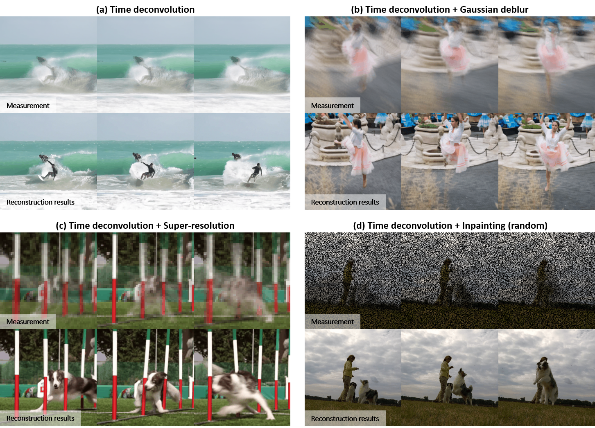

# Accessing Video Time Deconvolution using Image Diffusion Models

<p align="center" width="100%">
    
</p>

Our method demonstrates robustness against various combinations of temporal and spatial degradations, achieving state-of-the-art reconstructions.

[](https://video-timedeconv.github.io/main/)

## Abstract

Diffusion model-based inverse problem solvers (DIS) enable unconditional diffusion models to solve a wide range of image inverse problems. 
However, their application to video inverse problems involving temporal degradation remains limited. 
In response, we present a novel approach for addressing video time deconvolution using only image-based diffusion models. 
This innovation addresses the batch inconsistency issue in diffusion models by controlling batch-stochasticity, thereby enabling batch-consistent sampling.
Experimental results confirm that our method demonstrates robustness against various combinations of temporal and spatial degradations, achieving state-of-the-art reconstructions.

## Download pre-trained models

This repository is based on [openai/guided-diffusion](https://github.com/openai/guided-diffusion).

 * 256x256 diffusion (not class conditional): [256x256_diffusion_uncond.pt](https://openaipublic.blob.core.windows.net/diffusion/jul-2021/256x256_diffusion_uncond.pt)

Download the following pre-trained model and move into a folder called `models/`.

## Time Deconvolution Sampling from pre-trained models

To sample from the models, you can use the `TimeDeconv.py` script.
Here, we provide flags for sampling from the model.
We assume that you have downloaded the relevant model checkpoints into a folder called `models/`.

```
bash sample.sh
```

## Video Data Samples

We preprocessed DAVIS 2017 train/val dataset into numpy datasets.
Here, we provide full preprocessed numpy files used in this work.

[Preprocessed 2017 DAVIS train/val dataset](https://drive.google.com/file/d/1sP2mkf7TTc3LmIYZktNV1xifDS20WJ-7/view?usp=sharing).

## Citation

If you find our method useful, please cite as below or leave a star to this repository.

```
@article{

}
```

> [!note]
> This work is currently in the preprint stage, and there may be some changes to the code.
